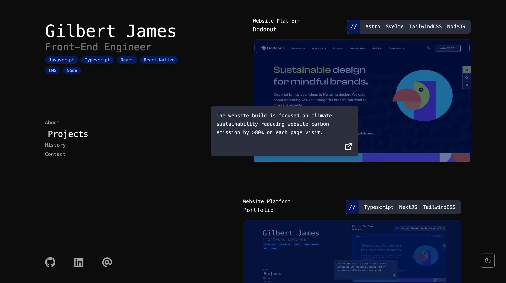
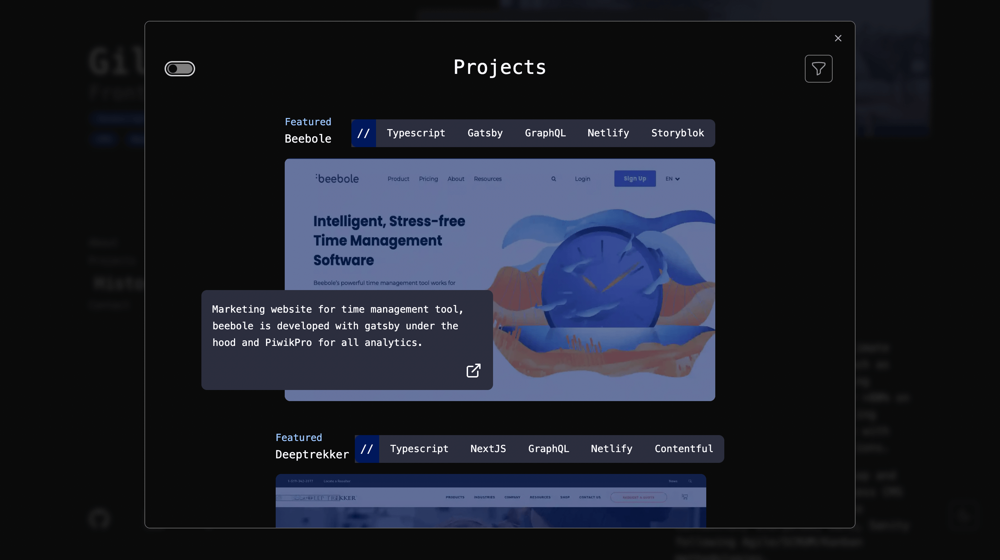

# Portfolio Website

A personal website to showcase current projects. 

## Project Status

Most of the core components of this project have been been built, more features are expected to the added. Presently, the project is in a maintenace mode but will be updated as regularly as possible by the author.

### Landing page with all my links





## Technologies

The website is built using the following technologies:

-   [Next.js](https://nextjs.org/) 14: A framework for building React applications
-   [TypeScript](https://www.typescriptlang.org/): A strongly-typed superset of JavaScript
-   [TailwindCSS](https://tailwindcss.com/): A utility-first CSS framework
-   [NextAuth.js](https://authjs.dev/): Authentication for the web
-   [Vercel](https://vercel.com/): A cloud platform for static sites and Serverless Functions
-   [Plausible](https://plausible.io/): A simple, open-source, lightweight (< 1 KB) and privacy-friendly web analytics system


## Getting Started

First, install the necessary dependencies:

```bash
npm install
```

then, run the development server

```bash
npm run dev
```

Open [http://localhost:3000](http://localhost:3000) with your browser to see the index page.

## Deploy on Vercel

The easiest way to deploy your Next.js app is to use the [Vercel Platform](https://vercel.com/new?utm_medium=default-template&filter=next.js&utm_source=create-next-app&utm_campaign=create-next-app-readme) from the creators of Next.js.

Check out our [Next.js deployment documentation](https://nextjs.org/docs/deployment) for more details.
